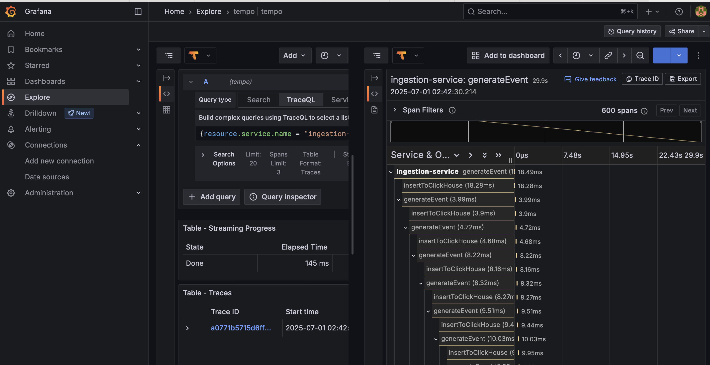
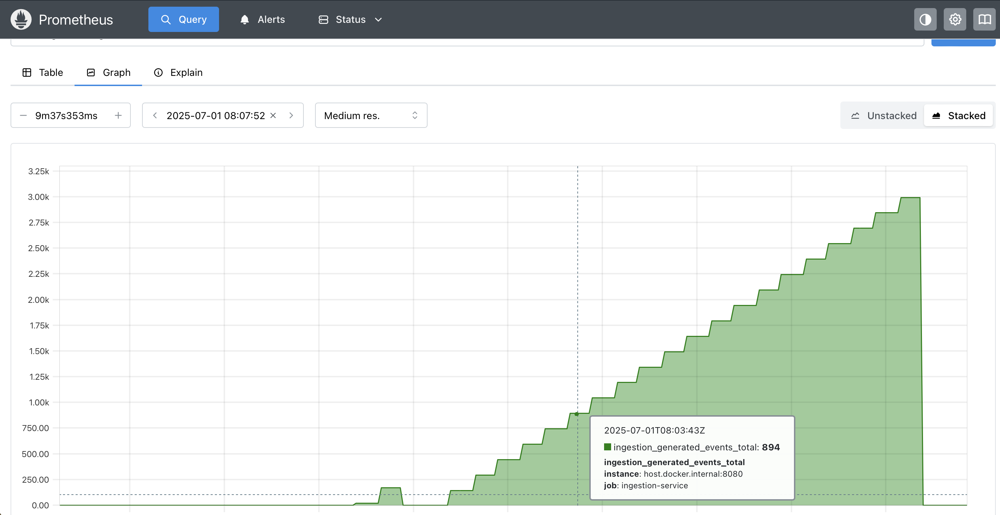

# 🚀 Observability Stack: Tempo • Prometheus • Grafana

Production-style local observability stack using Docker Compose. Supports OTEL trace ingestion, Prometheus metrics, and Grafana dashboards.

## 🔧 Stack Components

- **Tempo** – Distributed tracing (OTLP receiver)
- **Prometheus** – Metrics collection (scrapes /metrics)
- **Grafana** – Visualization for metrics and traces

## ▶️ Quick Start

```bash
docker-compose up -d
```

## 🔍 Traces and Observability

This project includes full OpenTelemetry tracing across the ingestion pipeline. Below is a trace captured in Grafana Tempo showing end-to-end span visibility for the `ingestion-service`, including synthetic event generation and database inserts to ClickHouse.



- Parent span: `generateEvent`
- Child spans: `insertToClickHouse`
- Exported via OTEL Collector → Grafana Alloy → Tempo
- Visualized with TraceQL in Grafana Explore

Traces enable performance analysis, debugging, and latency breakdown across services.

## 📊 Prometheus Metrics

The observability stack includes Prometheus scraping custom metrics from the ingestion service. Below is a Prometheus graph showing `ingestion_generated_events_total`, a counter exposed by the Go-based ingestion app to track synthetic event generation over time.



- Metric: `ingestion_generated_events_total`
- Source: Go ingestion service (`host.docker.internal:8080`)
- Scraped by: Prometheus via Alloy
- Use case: Verifies ingestion activity and enables real-time pipeline monitoring